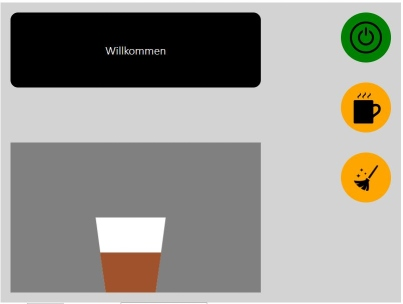

# Kaffeemaschine Betriebshandbuch

Wir freuen uns, dass sie sich für unsere wunderbare Kaffeemaschine entschieden haben. 
Genießen sie leckeren Kaffee, der immer frisch zubereitet wird.

### Inbetriebnahme

Damit die Funktionen der Kaffeemaschine genutzt werden können, muss sie zunächst
eingeschaltet werden. Dann stehen alle weiteren Funktionen zur Verfügung
Bitte wählen sie zunächst die gewünschte Sprache, dann werden ihnen auf dem Display Hinweise zur Bedienung angezeigt.

Wenn die Maschine noch [nicht eingeschaltet wurde](- "c:assert-true=isNotTurnedOn()"), erscheint auf dem Display der Hinweis "[Bitte den Einschaltknopf drücken!](- "?=getMessage()")".

Wenn die Maschine [eingeschaltet wird](- "turnOn()"), [leuchtet der Einschaltknopf grün](- "c:assert-true=isTurnedOn()") und auf dem Display wird der Hinweis "[Willkommen](- "?=getMessage()")" angezeigt. 
